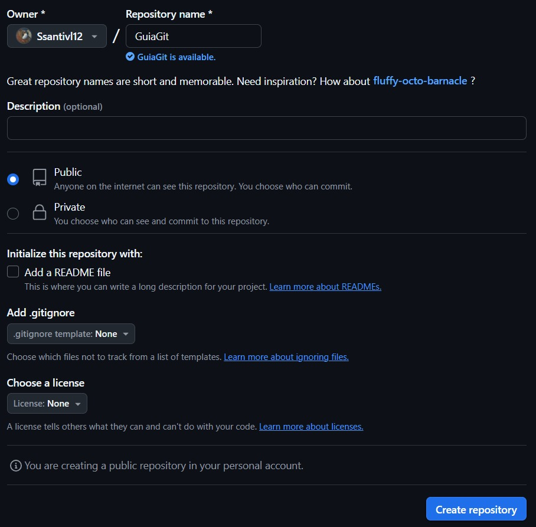
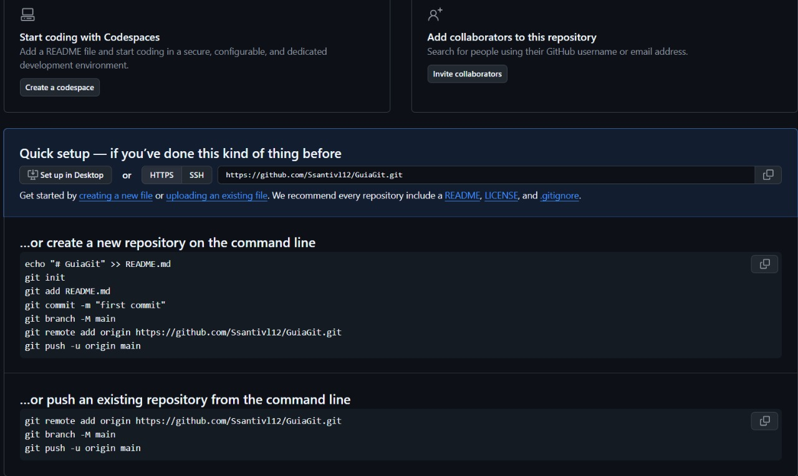

# Conexión de repositorios remotos

Un repositorio remoto es una copia del proyecto que esta alojada en internet, como GitHub, GitLab, o Bitbucket. Que sirven para compartir el código, colaborar con otras personas o simplemente tener un respaldo del proyecto 

El ejemplo se desarrollará en GitHub, que es alojamiento de repositorios mas conocido y usado. Para ello primero se debe crear una cuenta  

Luego de creada la cuenta creando el primero repositorio se creará el repositorio, donde deberémos ingresar el nombre del repositorio, además nos dará la opción de agregar un *README.md* que es un archivo como este y/o alguna licencia para el proyecto. En este caso se creará un reposotorio vació

 
   

Luego de qu e este este creado tenemos que enlazarlo con nuestro repositorio local, previamente a ello debemos inicializar Git en un proyecto hacer por lo menos un commit en nuestra repositorio local, por convención igual se cambiará el nombre la rama principal de *master* a *main*  

Luego se enlazará el repositorio local con el remoto con el comando
`git remote add origin url_del_proyecto.git` y se [pushea](#comandos-con-repositorios-remotos) los cambios

 
   

## Comandos con repositorios remotos

Como ya se vió el primer comando es para manejar repositorios remotos es e `git add`  

Ahora continuaremos con los demas comandos:

- `git remote -v`: Muestra los repositorios remotos conectados con sus URL's 

- `git push -u origin nombre_rama_a_subir` : Este comando subre tu rama al repositorio remoto remoto, el `-u` en el comando solo se debe usar la primera vez, para que cuando estes en una rama en la que ya hayas aplicado el `-u` solo necesites hacer el comando `git push` sin indicar la rama

- `git clone url_del_proyecto.git` : Este comando descarga un repositorio remoto, con una copiea de todo el historial para el local (se debe aplicar en un proyecto vacio con Git incializado)

- `git fetch` : Descarga los cambios del remoto pero no los aplica en el código

- `git pull` : Desvarga y aplica los cambios al instante

- `git pull nombre_rama` : Descarga y aplica los cambios, pero solo para la rama indicada

# Pull request y colaboración

## ¿Qué es un Pull Request?

Es una solicitud para fusionar los cambios de una rama con otra, esto se hace en GitHub y necesita previa aprovación para integrar los cambios en que se envian al repositorio remoto  

### Diferencias entre git merge y PR (Pull Request)

El git merge se hace localmente en la máquina, mientras que el PR se hace desde GitHub, permitiendo que se revise el código, se discuta la revision con otros colaboradores y da opción a aprobar o rechazar los cambios

### Tipos de PR

Cuando haces “Merge pull request”, GitHub te da 3 opciones:

- Merge commit: mantiene el historial de ambas ramas

- Squash and merge: une todos los commits en uno solo, dejando un historial más limpio

- Rebase and merge: reescribe los commits de la rama como si fueran nuevos encima de main

## ¿Qué es un fork y cómo colaborar?
Un fork es una compia completa del repositorio en tu propia cuenta de GitHub, usado para contribuir a proyectos en los que no se tiene permisos directos  

Pasos para colaborar con un fork: 

- Haz fork del repositorio

- Clónalo a tu computadora

- Crea una rama, haz tus cambios

- Sube la rama a tu repositorio (fork)

- Abre un Pull Request hacia el repositorio original

