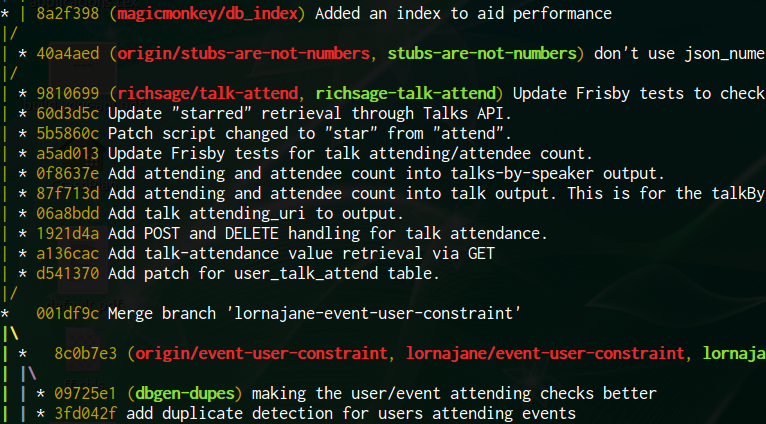

# ¿Qué es una rama?
Una rama es una línea de trabajo en un proyecto. Cuando inicias un proyecto con `git init`, automáticamente estas en una rama llamada **main** (antes llamada **master**), esta rama representará la versión principal del proyecto  

Crear una nueva rama te permitirá desarrollar funcionalidades, corregir el código o experimentar sin modificar directamente **main**. Una vez concluidos los cambios y esten correctamente aplicados y probados podrás unir estas ramas usando un [merge](#comandos-para-manejar-ramas)  

El uso de las ramas ayuda a mantener el proyecto ordenado y limpio, protegiendo el código principal mientras desarrollas algo nuevo. Además de permitir un buen flujo de desarrollo entre varias personas, que estas pueden trabajar en distintas ramas sin afectar a los demas y cada rama puede representar una nueva funcionalidad, corrección o prueva

# Comandos para manejar ramas
- `git branch` : Muestra una lista de todas las ramas de tu repositorio local e indica en cual estas trabajando actualmente
- `git branch nombre_rama` : Crea una nueva rama con el nombre que le des (sin cambiarte a la rama que creaste). Esta manejará el estado actual de la rama en desde la cual la crees
- `git switch nombre_rama` : Es la forma moderna y recomendada de cambiar de una rama a otra
- `git switch -c nueva_rama` : Agregandolé `-c` indicas que crearás una nueva rama y que te cambie a esa rama a la vez
- `git chechout nombre_rama ` : Este comando se usaba, y aún se puede utilizar, para cambiar de rama. Pero este tambien tiene otras funcionalidades como; cambiar a un commit específico o crear una copia temporal, restaurar archivos a un estado anterior. Pero por su complejidad y multiples usos, Git creó `git switch` para que el cambio de ramas fuera más fácil de entender y evitar errores
- `git checkout -b nueva_rama` : Este comando crea una nueva rama y te cambia a esa rama a la vez
- `git merge rama_a_unir` : Sirve para fusionar los cambios de una rama con otra (Se verá mas sobre el merge en el siguiente tema)

Ya se vio anteriormente que el comando `git log` mostraba el historial de los commits realizados, pero agregandole mas parámetros podrémos ver un resumen del historial inclusive con ver como se conectan las ramas:  

`git log --oneline --graph`

