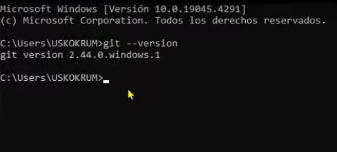

# Introducción a Git
Git es una herramienta de control de versiones, que registra los cambios en los archivos, permitiendo comparar los versiones, ver el historial de cambios y revertir a estados anteriores. Además es distribuido, lo que quiere decir que; cada desarrollador tiene su propia copia del repositorio, facilitando la colaboración entre equipos permitiendo que diferentes desarrolladores trabajen en un mismo proyecto a la vez de manera coordinada y ordenada

## Instalación de Git

 Paso a paso 

La descarga se debe realizar desde la página oficial de [Git](https://git-scm.com/downloads) y elige la versión dependiendo de tu sistema operativo  
Luego de descargar, ejecuta el archivo y comenzamos con la instalación  

1. Como primer paso debemos leer y aceptar la licencia 

  

2. Elegimos el directorio en el que será instalado (recomendado dejar el valor predetermminado)

  

3. Instalación de componentes (recomendado dejar el valor predetermminado)

  

4. Elegit el editor de texto para Git (recomendado dejar el valor predetermminado)

  

5. Selecciona el nombre de la rama inicial (por defecto es ‘master’, pero puedes cambiarlo a ‘main’ al crear un nuevo repositorio)

  

6. Ajustar el entorno de ejecución de Git (recomendado dejar el valor predetermminado, permitiendo ejecutar Git desde otras terminales de comando)

  

7. Elegir la Shell que usará Git (recomendado dejar el valor predetermminado)

  

8. Elección del backend de transporte HTTPS (recomendado dejar el valor predetermminado)

  

9. Cada sistema operativo tiene una manera diferente de representar los finales de linea (CRLF y LF), se recomienda dejar marcada la opción por defecto para asegurar que no haya errores por diferencias de formatos entre sistemas operativos

  

10. Elegir el emulador de terminal para Git Bash(recomendado dejar el valor predetermminado)

  

11. Elegir el comportamiento de Git cuando se realice un 'pull' (recomendado dejar el valor predetermminado)

  

12. Elegir el manejador de credenciales (recomendado dejar el valor predetermminado)

  

13. Configuraciones extra (recomendado dejar el valor predetermminado)

  

14. Configurar opciones experimentales (No marques ninguna casilla a menos que sepas exactamente qué hacen y por qué las necesitas)

  

15. Continuando se instalará Git con las opciones elegidas

  

16. Terminada la instalación se mostrará un panel indicando que la instalación ha sido completada correctamente

  

17. Por último se debe corroborar la instalación abriendo una nueva terminal (CMD o PowerShell en el caso de Windows) y ejecutando el comando `git --version` , mostrando la versión de Git que se instaló

  

## Primeros comandos

Ya instalado correctamente Git comenzaremos con la explicación de una serie de comandos principales

- `git init` : Primer comando que se debe realizar al iniciar un proyecto, inicializa Git crea un repositorio local
- Configura tu identidad, antes de hacer tus primero commits debes indicarle Git quien eres, esto para que pueda registrar correctamente tus cambios en el historial
    + `git config --global user.name "Tu Nombre"`
    + `git config --global user.email "tuemail@example.com"`
    El uso de `--global` indica que esa configuración a todos los proyectos de tu computadora

- `git add ` Añade archivos al [staging area](#staging-area). Se puede usar `git add .` para añadir todos los archivos con cambios o `git add archivo.txt` para añadirlos uno por uno
- `git commit` [Guarda los cambios agregados al staging area](#guardado-de-cambios-commits),este te solicitará un mensaje para nombrar los cambios a guardar, tambien se puede usar `git commit -m "mensaje"` para ingresar el mensaje en un solo comando 
- `git status` Muestra el estado de los archivos, si fueron o no agregados al staging area
- `git log` Muestra el historial de los commits ya realizados, incluye la fecha, mensaje y el autor de cada uno

  

## Conceptos básicos 

### Staging area
Es una *zona intermedia* en la que estan los archivos que estan listos para ser guardados. Es una lista de cambios que le diras a Git que quieres conservar, solo los archivos en el staging area se incluiran en el siguiente commit

### Guardado de cambios (Commits)
Un commit es como una foto del estado actual de tu proyecto. Cada commit guarda los cambios realizados, permitiendo volver a estados anteriores si algo sale mal y conforman el historial de desarrollo 

