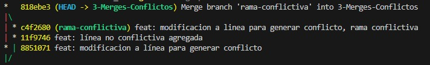

# ¿Qué hace Git Merge?
Como ya vimos, `git merge` se usa para fusionar los cambios de una rama con otra, siendo útil cuando trabajaste en una rama nueva *nueva-funcionalidad* y ahora quieres que esos cambios que integren en la rama *main*, para ello debes estar en la rama *main* y recien realzar el comando `git merge nueva-funcionalidad` para traer los cambios a la rama  

Cuando se realiza un *merge* Git crea un commit automáticamente porque puede realizar los cambios por si mismo, pero esto no ocure cuando hay conflictos

## ¿Por qué ocuren los conflictos?
Los conflictos ocurren cuando Git no sabe como combinar los cambios de ambas ramas, esto puede pasar cuando

- Dos ramas tienen los cambios en una misma línea de un archivo
- Un archivo fue eliminado en una rama y modificado en otra  

Por ello Git no puede adivinar cual cambio es correcto y te solicitará resolverlo  

### ¿Cómo se resuelve un conflicto?

En este caso se generó un conflicto en el archivo *archivo-conflicto.py*

 
   
   

Luego de indicar el conflicto ocurido, para resolverlo Git dará a escoger que cambios se guardarán del conflicto, los cambios escogídos serán los que se mantendrán y guardarán en el *merge*

 
   

Tras resolver el conflicto Git creará un nuevo commit para registrar como se resolvió el conflicto, pero este commit no se crea automáticamente, se crea luego de la resolución que se realizó

 
   

> `git mergetool`, esta es una herramienta opcional que contiene una interfaz gráfica para resolver los conflictos **(debe ser instalada previamente)** 